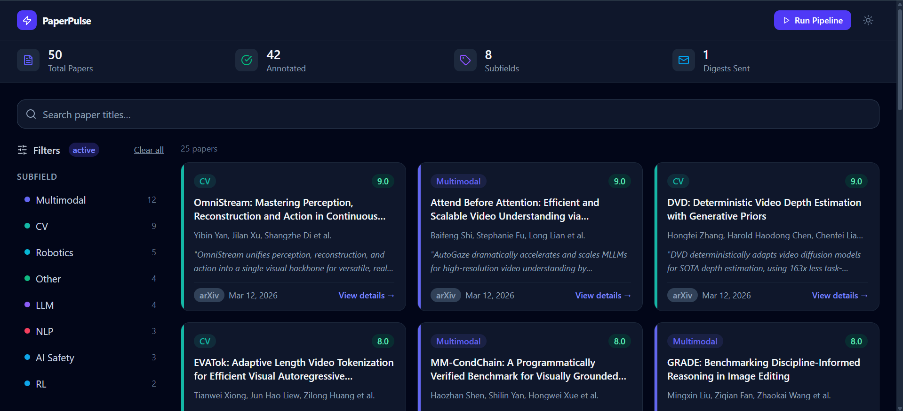
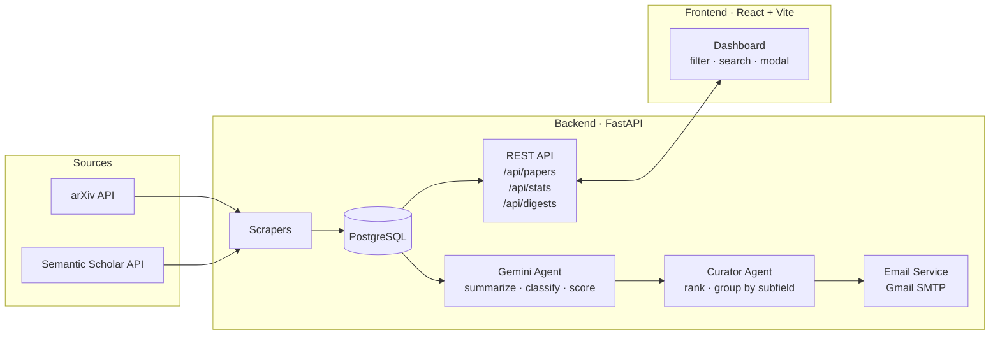

# PaperPulse

**AI-powered research paper digest — scrape, summarize, and deliver the papers that matter.**


**[Live Demo →](https://paperpulse-90fd.onrender.com)**

---


> *[View the live demo](https://paperpulse-90fd.onrender.com)*

---

## Features

- **Automated scraping** — pulls new papers daily from arXiv and Semantic Scholar across configurable categories
- **AI annotation** — Gemini 2.5 Flash generates a plain-English summary, subfield label, impact score (0–10), and one-line key takeaway for each paper
- **Curated email digest** — daily HTML email groups top papers by subfield and highlights the most impactful work
- **Filterable dashboard** — filter by subfield, date range, and minimum impact score; full-text search on titles
- **Paper detail modal** — full abstract, AI summary, key takeaway, and direct links to the PDF and landing page
- **Dark / light mode** — persisted to `localStorage`, respects system preference on first visit
- **Responsive design** — works on mobile, tablet, and desktop
- **One-command deploy** — `render.yaml` Blueprint provisions the database, web service, and daily cron job automatically

---

## Architecture



The pipeline (`scrape → annotate → curate → email`) runs as a Render cron job at 08:00 UTC daily and can also be triggered manually from the dashboard.

---

## Tech Stack

| Layer | Technology |
|---|---|
| **Backend** | Python 3.11, FastAPI, SQLAlchemy 2.0 (async) |
| **Database** | SQLite (`aiosqlite`) locally · PostgreSQL (`asyncpg`) in production |
| **AI** | Google Gemini 2.5 Flash via `google-genai` |
| **Frontend** | React 18, Vite 5, Tailwind CSS v4 |
| **Data fetching** | TanStack Query v5, Axios |
| **Email** | Gmail SMTP with App Password auth |
| **Deployment** | Render — web service + managed Postgres + cron job |

---

## Local Setup

### Prerequisites

- Python 3.11+
- Node.js 18+
- A [Google AI Studio](https://aistudio.google.com/) API key (free tier: 250 req/day)
- A Gmail account with an [App Password](https://support.google.com/accounts/answer/185833) configured

### 1. Clone and configure

```bash
git clone https://github.com/your-username/paperpulse.git
cd paperpulse
cp .env.example .env   # then fill in your values
```

`.env` template:

```env
GEMINI_API_KEY=your_key_here
MY_EMAIL=you@gmail.com
APP_PASSWORD=your_16_char_app_password
DIGEST_RECIPIENTS=you@gmail.com,colleague@gmail.com

# Optional overrides
ARXIV_CATEGORIES=cs.CL,cs.AI,cs.LG,cs.CV,cs.RO
MAX_PAPERS_PER_RUN=50
DAYS_LOOKBACK=1
```

### 2. Backend

```bash
cd backend
python -m venv .venv
source .venv/bin/activate      # Windows: .venv\Scripts\activate
pip install -r requirements.txt
uvicorn app.main:app --reload
# API at http://localhost:8000
```

### 3. Frontend

```bash
cd frontend
npm install
npm run dev
# Dashboard at http://localhost:5173
```

### 4. Run the pipeline manually

```bash
cd backend
python -m app.services.pipeline
```

Scrapes papers, annotates them with Gemini, and sends the digest to `DIGEST_RECIPIENTS`. The dashboard **Run Pipeline** button does the same thing via `POST /api/pipeline/run`.

---

## Deploy to Render

Render reads `render.yaml` and provisions everything automatically.

### 1. Push to GitHub

```bash
git remote add origin https://github.com/your-username/paperpulse.git
git push -u origin main
```

### 2. Create a Blueprint

1. [Render Dashboard](https://dashboard.render.com) → **New → Blueprint**
2. Connect your GitHub repo
3. Render detects `render.yaml` and creates:
   - `paperpulse-db` — managed PostgreSQL (free tier)
   - `paperpulse-api` — web service (builds frontend + backend, serves both from one URL)
   - `paperpulse-daily-digest` — cron job at 08:00 UTC

### 3. Set secret environment variables

Set these in the Render dashboard for **both** `paperpulse-api` and `paperpulse-daily-digest`:

| Variable | Where to get it |
|---|---|
| `GEMINI_API_KEY` | [Google AI Studio](https://aistudio.google.com/) |
| `MY_EMAIL` | Your Gmail address |
| `APP_PASSWORD` | Gmail → Account → Security → App Passwords |
| `DIGEST_RECIPIENTS` | Comma-separated list of recipient emails |

### 4. Set `ALLOWED_ORIGINS`

Once the service URL is assigned (e.g. `https://paperpulse-90fd.onrender.com`), set on `paperpulse-api`:

```
ALLOWED_ORIGINS=https://paperpulse-90fd.onrender.com
```

`DATABASE_URL` is injected automatically from the managed database — no action needed.

---

## Environment Variables Reference

| Variable | Required | Default | Description |
|---|---|---|---|
| `DATABASE_URL` | prod only | SQLite file | Injected by Render. Locally defaults to `sqlite+aiosqlite:///./paperpulse.db` |
| `GEMINI_API_KEY` | yes | — | Google AI Studio key for paper annotation |
| `MY_EMAIL` | yes | — | Gmail address used as the digest sender |
| `APP_PASSWORD` | yes | — | Gmail App Password (not your account password) |
| `DIGEST_RECIPIENTS` | yes | — | Comma-separated list of digest recipient emails |
| `ALLOWED_ORIGINS` | prod | `http://localhost:5173` | Comma-separated CORS origins |
| `ARXIV_CATEGORIES` | no | `cs.CL,cs.AI,cs.LG,cs.CV,cs.RO` | arXiv category codes to scrape |
| `MAX_PAPERS_PER_RUN` | no | `50` | Maximum papers fetched per pipeline run |
| `DAYS_LOOKBACK` | no | `1` | Days back to look when scraping |
| `SEMANTIC_SCHOLAR_API_KEY` | no | — | Raises Semantic Scholar rate limit from 10 to 100 req/s |

---

## Project Structure

```
paperpulse/
├── backend/
│   ├── app/
│   │   ├── main.py              # FastAPI app, static file serving
│   │   ├── config.py            # Settings via pydantic-settings
│   │   ├── database.py          # Async SQLAlchemy engine + ORM models
│   │   ├── models.py            # Pydantic response schemas
│   │   ├── routers/             # papers, digests, stats, pipeline
│   │   ├── scrapers/            # arXiv and Semantic Scholar
│   │   ├── agents/              # Gemini summarizer and curator
│   │   └── services/            # pipeline orchestrator, email sender
│   └── requirements.txt
├── frontend/
│   ├── src/
│   │   ├── App.jsx              # Layout shell, state, theme
│   │   ├── api/client.js        # Axios + TanStack Query functions
│   │   ├── components/          # StatsBar, FilterSidebar, PaperGrid,
│   │   │                        # PaperCard, PaperModal, SearchBar
│   │   ├── hooks/useTheme.js    # Dark/light mode toggle
│   │   └── utils/subfieldColor.js
│   └── package.json
├── render.yaml                  # Render Blueprint (DB + web service + cron)
└── runtime.txt                  # Python 3.11.0
```

---

## License

MIT
